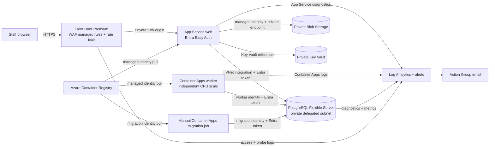

# Production architecture

The public edge is Front Door Premium with a prevention-mode managed WAF ruleset
and a rate limit. It reaches the web app over Private Link. App Service disables
its public network path and requires Microsoft Entra sign-in through Easy Auth.
The worker and migration job run as separate Container Apps resources in an
internal, VNet-injected environment. The worker scales independently; the
migration job runs only when manually triggered. Web, worker, and migration
compute use separate managed identities.

## Service choices

| Requirement | Azure service | Reason |
|---|---|---|
| Private relational data | Azure Database for PostgreSQL Flexible Server, VNet injected | No public database endpoint; Entra authentication is enabled and password authentication is disabled. |
| Private CSV objects | Azure Blob Storage, private endpoint, private DNS, public access disabled | Stores uploaded originals and rejected CSV exports; Blob access uses managed identities and RBAC. |
| Work account sign-in | App Service Authentication (Easy Auth) with Microsoft Entra ID | Enforces authentication before requests reach the Next.js app. A single-tenant app registration is supplied as a deployment parameter. |
| Public edge protection | Front Door Premium private origin and WAF | Managed attack rules, HTTPS redirection, rate limiting, and no direct public App Service origin. |
| Separate execution and scaling | App Service web, Container Apps worker, Container Apps migration job | Web scales on App Service plan CPU; worker has its own Container Apps CPU scale rule; migrations run on demand. |
| Searchable telemetry and paging | Log Analytics, Azure Monitor alerts and Action Group | Centralizes web, worker, PostgreSQL, and Front Door logs and metrics; pages the configured operations email on web 5xx or sustained database CPU. |
| Image distribution | Azure Container Registry with admin login disabled | Web, worker, and migration job pull using their managed identities. |
| Secret storage | Azure Key Vault with private endpoint and RBAC | The Entra client secret is a versionless Key Vault reference. No secret value is written to Bicep or App Service settings. |

## Why the database is private-only

PostgreSQL is injected into a delegated VNet subnet and has public network access
disabled. App Service uses regional VNet integration, and the worker and
migration job share an internal Container Apps environment in that VNet. Private
DNS resolves the server name to its private address. The web, worker, and
migration job obtain short-lived PostgreSQL Entra tokens with separate
user-assigned identities; no database password is placed in app configuration.
Only the web application uses Blob Storage, through its managed identity.
Storage and Key Vault also disable public access and use private endpoints.

## How secrets reach the app and how to rotate them

The web app's Entra client secret is stored in Key Vault. App Service Authentication
reads it through an unversioned Key Vault reference, authorized by the web
identity's Key Vault Secrets User role. Rotate the Entra secret in the app
registration and update the Key Vault secret value; refresh the App Service Key
Vault references if the new value must be picked up immediately. PostgreSQL and
Blob access use managed identity tokens, so there are no app credentials to
rotate. Local Docker Compose uses ignored secret files, never committed values.

## How a Wait survives a deploy or restart

Every matter has its own `workflow_runs` row. A Wait stores the node and its due
time in Postgres. The worker leases due rows using row locks; an expired lease
can be claimed after a process restart. Deploying a new worker does not remove
scheduled work. Workflow definitions are snapshotted when the batch starts, so
publishing a new version cannot change an existing run.

## How database migrations avoid downtime

Run the one-shot Container Apps migration job before the web or worker revision
that needs the new schema. The migration runner uses a Postgres advisory lock,
applies each numbered file in a transaction, and skips files already recorded.
For changes used by old and new revisions, use expand-and-contract: add nullable
or additive schema first, deploy code that can read both shapes, backfill, then
remove the old shape in a later migration. Avoid long locks and destructive
backfills in a request-time deployment.

Deployment is a two-phase Bicep rollout so the registry exists before app
images are required. First deploy with `deployWorkloads: false` (the default)
to create the private data/network foundation, Key Vault, identities, and ACR.
Create a single-tenant Entra app registration and pass its client ID to both
deployments. The template creates separate web, worker, and migration
identities. Before deploying workloads, create their PostgreSQL Entra
principals and grant the required database and schema permissions. From a
network that can reach the private Key Vault endpoint, seed the client secret
under `entra-web-client-secret` (the vault has no public network access). Grant
the image publishing identity `AcrPush` on the registry, then push the `web`
and `worker` image tags. Deploy again with `deployWorkloads: true` and the
pushed `imageTag`. Add the emitted Front Door hostname plus
`/.auth/login/aad/callback` to the app registration, and approve Front Door's
pending Private Link request on the App Service. Run the migration job and
confirm success before directing production traffic to the application.

For database bootstrap, connect as the configured Entra administrator and
create regular PostgreSQL principals for the emitted web, worker, and migration
identity names using `pgaadauth_create_principal('<identity-name>', false, false)`.
Grant `CONNECT` on `ledgerline` and `USAGE` on `public` to all three, and grant
the migration principal `CREATE` on `public`. Configure default privileges for
objects created by the migration principal to grant the web and worker
principals only `SELECT`, `INSERT`, and `UPDATE` on future tables and
`USAGE`/`SELECT` on future sequences. Run the migration job as the migration
principal so it owns the migration-created objects. Do not grant runtime
identities `CREATEDB`, `CREATEROLE`, or PostgreSQL administrator membership.

## What to monitor and what should wake someone up

Search App Service HTTP/console logs, Container Apps console logs, PostgreSQL
logs and metrics, and Front Door access/health probes in Log Analytics. The
included alerts page the configured operations email for sustained web 5xx
responses and high PostgreSQL CPU. Add a worker-failure/oldest-due-run alert,
Blob upload failures, database connection exhaustion, and storage capacity
alerts before production traffic. A 3am page should correspond to a broken user
flow, stalled workflow queue, database outage, or inability to safely retain
client CSVs.

## Manual deployment steps

- Register the single-tenant Entra app and deploy Bicep once with
  `deployWorkloads: false`; no Azure deployment has been performed for this
  take-home.
- Create PostgreSQL Entra principals for the web, worker, and migration
  identities, and grant the database permissions described above.
- From private network access, seed the Key Vault secret; grant the image
  publisher `AcrPush` and push the web and worker images to ACR.
- Redeploy with `deployWorkloads: true` and the published `imageTag`.
- Add Front Door's callback URI to the app registration and approve its pending
  Private Link connection to App Service.
- Run the migration job and confirm success before directing production
  traffic to the application.
