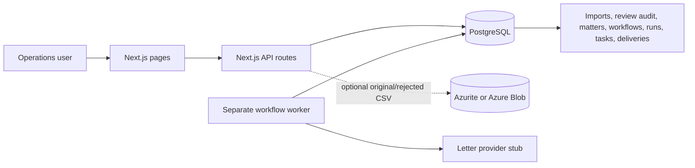

# Implementation guide and local walkthrough

This guide explains what is implemented, how the sidebar maps to the user
journey, which files implement each part, and how to run and verify it locally.
It is a local prototype backed by PostgreSQL; the Azure design is infrastructure
as code and documentation, not a deployed Azure environment.

## What the assignment asks for

The take-home is one operations workflow:

1. Import a client CSV and map its columns to matter fields.
2. Validate every row, show safe cleanup and errors, and require a human decision
   for every row.
3. Create matters only from approved rows; keep rejection reasons and review
   history.
4. Design and publish a letter workflow using Send letter, Wait, and Staff task
   steps.
5. Run that workflow independently for approved matters and keep progress
   through worker or web restarts.
6. Describe a secure Azure production design, build production-like local
   containers, and run CI checks without deploying to Azure.

The app calls the supplied stub in [letter-provider.ts](../src/lib/letter-provider.ts).
It returns a fake queued provider ID for demonstration; it does not send real
letters. That file was left unchanged.

## Architecture at a glance



In local development, PostgreSQL runs in Docker and the Next.js app and worker
run as Node processes. Blob storage is optional in this mode. Production-like
Compose adds Azurite and uses file-mounted secrets. The Azure design in
[ARCHITECTURE.md](../ARCHITECTURE.md) uses private PostgreSQL, Blob Storage and
Key Vault, managed identities, Entra sign-in, Front Door/WAF, a separate worker,
and Log Analytics. No Azure resources have been deployed.

## Follow the sidebar through the app

The sidebar and the Overview cards both read from [nav.ts](../src/lib/nav.ts).
Open any of these links after starting the local app:

| Sidebar section | URL | What to look at | Main implementation |
|---|---|---|---|
| Overview | [http://localhost:3000/](http://localhost:3000/) | Entry point and links for each phase | [Overview page](../src/app/page.tsx) |
| Matters → Import | [http://localhost:3000/import](http://localhost:3000/import) | Upload CSV, map columns, validate, save all rows for review | [Upload UI](../src/components/matter-csv-upload.tsx), [import API](../src/app/api/imports/route.ts), [CSV validation](../src/lib/matter-csv-validation.ts) |
| Matters → Review | [http://localhost:3000/review](http://localhost:3000/review) | Select an import; inspect findings and source values; enter reviewer name; correct, approve or reject each row; download rejected CSV | [Review UI](../src/components/review-queue.tsx), [review decision API](<../src/app/api/imports/[importId]/rows/[rowId]/decision/route.ts>) |
| Matters → Matters | [http://localhost:3000/matters](http://localhost:3000/matters) | Search and page through approved matters only | [Matter list](../src/components/matter-list.tsx), [matters API](../src/app/api/matters/route.ts) |
| Matter detail | Open a matter reference from Matters, Runs, or Staff tasks | Matter fields, source CSV/row, original imported values, review audit and corrections | [Matter detail page](<../src/app/matters/[matterId]/page.tsx>), [matter API](<../src/app/api/matters/[matterId]/route.ts>) |
| Workflows → Workflows | [http://localhost:3000/workflows](http://localhost:3000/workflows) | Add steps, connect the path, configure letters/waits/tasks, preview a real approved matter, validate, save draft and publish | [Canvas UI](../src/components/workflow-canvas.tsx), [workflow validation](../src/lib/workflow-validation.ts), [workflow APIs](../src/app/api/workflows/) |
| Workflows → Runs | [http://localhost:3000/runs](http://localhost:3000/runs) | Start a published workflow on approved matters; inspect each matter's state, wait time, letters, errors and tasks | [Run UI](../src/components/run-console.tsx), [run API](../src/app/api/runs/) |
| Workflows → Staff tasks | [http://localhost:3000/tasks](http://localhost:3000/tasks) | See open tasks, enter a staff name, complete a task and resume only its matter's run | [Task UI](../src/components/task-board.tsx), [task API](../src/app/api/tasks/) |

The API health route is [http://localhost:3000/api/health](http://localhost:3000/api/health).
It returns `{ "ok": true, "database": "connected" }` when the app can reach
PostgreSQL.

During this guide update, that endpoint returned `ok: true` and
`database: connected` from the current local instance.

## Run the local development setup

Use PowerShell from the repository root. The commands below start only the
development PostgreSQL service; they do not start the production-like Compose
stack.

```powershell
npm.cmd install
if (-not (Test-Path .env.local)) { Copy-Item .env.example .env.local }
npm.cmd run db:up
npm.cmd run db:migrate
```

Then leave the app and worker running in separate terminals:

```powershell
# Terminal 1
npm.cmd run dev
```

```powershell
# Terminal 2
npm.cmd run worker
```

Visit [http://localhost:3000](http://localhost:3000). The example database URL
uses port 5433 on the host. Keep `.env.local` private; it is ignored by Git.
The local development Compose file only starts Postgres. It does not include
Azurite or the web/worker containers.

### Walk through a complete sample

1. Go to **Import** and choose [data/matters.csv](../data/matters.csv). Review
   the detected column mapping. Map required fields if any are blank, then
   click **Validate CSV** and **Save all rows for review**. Rows with findings
   are still imported so a person can decide them. The file is limited to 5 MB
   and 10,000 rows.
2. Go to **Review**, select the import, enter a reviewer name, and inspect each
   row. The UI separates safe cleanup from errors and can expand the original
   CSV values. Correct fixable values before approval. Rejection requires a
   reason. Decide every row; only approved rows appear in **Matters**. The
   rejected CSV download includes rejection reasons.
3. In **Matters**, search by matter reference, debtor name, or client firm.
   Open a matter reference to see the original row and approval audit.
4. Go to **Workflows**. Keep the built-in Start and End nodes. Add a **Send
   letter**, **Wait**, and/or **Staff task** step from the left panel and
   connect them into one path. Select each step to edit its settings. A Send
   letter step needs a template, subject and body; preview it with an approved
   matter. Wait accepts whole minutes from 1 to 43,200. Staff task needs a
   title. Save a draft, then publish it after validation passes.
5. Go to **Runs**, select the published version and one or more approved
   matters, then start it. The page refreshes progress automatically. A Send
   letter step records a fake provider ID in this prototype.
6. If the run reaches a **Staff task**, open **Staff tasks**, enter a staff name
   and mark the task complete. Return to Runs to see that matter continue. A
   Wait appears as a persisted resume time; the worker resumes it when due.

Uploading the exact same CSV bytes a second time should return a duplicate
message rather than create another import. In plain local development without
Blob configuration, the app keeps imported row data but not the original CSV
file. The upload result says which storage behavior applied. The production-like
Compose setup configures Azurite; Azure configures Blob Storage.

## Verify the implementation

Run these checks from the repository root:

```powershell
npm.cmd run typecheck
npm.cmd test
npm.cmd run worker:build
npm.cmd run build
```

`npm.cmd test` compiles and runs the 11 unit tests for CSV validation,
workflow validation, and optional local Blob configuration. The tests do not
need Docker or Azure.

With Postgres migrated, the app running, and the worker running, execute the
workflow integration smoke:

```powershell
npm.cmd run smoke:workflow
```

It creates a synthetic matter and workflows, checks that a staff task pauses and
then resumes a run, checks that a Wait schedule is persisted and resumed, and
removes its synthetic database rows in a `finally` cleanup. Do not stop the
app/worker while this smoke command is running.

The prior implementation checks recorded in [DECISIONS.md](DECISIONS.md)
include live import/review/matter/workflow API smoke tests, the worker smoke,
11 unit tests, Docker image builds, Compose configuration validation, and
Bicep compile/lint. Azure deployment and a live Azurite container integration
test have not been performed.

## Optional production-like Docker Compose

This is a separate setup from local development and uses the same host port
3000, so stop the dev server before running it. The exact PowerShell secret-file
creation commands are in the [README Compose section](../README.md#production-like-docker-compose).
From the repository root:

```powershell
docker compose -f docker-compose.prod.yml config --quiet
docker compose -f docker-compose.prod.yml up --build
```

In another PowerShell window, verify the running services and endpoint:

```powershell
docker compose -f docker-compose.prod.yml ps
Invoke-RestMethod http://localhost:3000/api/health
docker compose -f docker-compose.prod.yml logs migrate
docker compose -f docker-compose.prod.yml logs web worker
```

Open the same sidebar URLs above to verify the UI. This setup tests the
production web/worker images, automatic migrations, private Postgres network,
and Azurite-backed CSV storage locally. It has not yet been run end to end.
The Compose service is named `azurite`; the web and worker can resolve it on
their shared private network. To check that the worker container resolves the
Azurite service after startup:

```powershell
docker compose -f docker-compose.prod.yml exec worker node -e "fetch('http://azurite:10000').then(r => { console.log('Azurite reachable:', r.status); process.exit(r.status < 500 ? 0 : 1); }).catch(e => { console.error(e); process.exit(1); })"
```

Stop it with `docker compose -f docker-compose.prod.yml down`. Avoid `down -v`
unless you intentionally want to delete its database and storage volumes.

The simpler [docker-compose.yml](../docker-compose.yml) remains the local
development database setup and publishes Postgres at `localhost:5433` for
running the app and worker directly with Node.js.

## Find the implementation by assessment part

| Assessment part | Main files |
|---|---|
| CSV import, mapping, validation, duplicate prevention | [Upload component](../src/components/matter-csv-upload.tsx), [validation](../src/lib/matter-csv-validation.ts), [imports API](../src/app/api/imports/), [initial and follow-up migrations](../migrations/) |
| Human review, approval/rejection audit, approved matters | [Review component](../src/components/review-queue.tsx), [review API](../src/app/api/imports/), [matters API/pages](../src/app/matters/), [audit migration](../migrations/003_review_audit_and_matter_ref.sql) |
| Workflow authoring, validation, templates | [Workflow canvas](../src/components/workflow-canvas.tsx), [validator](../src/lib/workflow-validation.ts), [template helpers](../src/lib/templates.ts), [workflow APIs](../src/app/api/workflows/) |
| Durable runs, Wait, staff tasks, letters | [Run/task APIs](../src/app/api/runs/), [task APIs](../src/app/api/tasks/), [worker](../scripts/workflow-worker.ts), [letter rendering](../src/lib/letter-rendering.ts), [workflow migrations](../migrations/004_workflow_batches_and_leases.sql) |
| Blob/Azurite and production-like containers | [Blob client](../src/lib/blob-storage.ts), [Dockerfile](../Dockerfile), [Compose](../docker-compose.prod.yml), [Docker ignore rules](../.dockerignore) |
| Azure infrastructure and CI | [Bicep](../infra/main.bicep), [Azure architecture](../ARCHITECTURE.md), [GitHub Actions](../.github/workflows/ci.yml) |

The shared database pool is in [db.ts](../src/lib/db.ts). Numbered schema
changes are applied by [migrate.mjs](../scripts/migrate.mjs); see
[migrations/README.md](../migrations/README.md). The workflow and verification
decisions are collected in [DECISIONS.md](DECISIONS.md).

## Current limitations to keep in mind

- Local pages do not authenticate users. Reviewer and staff names are entered
  manually; the Azure plan protects the production web app with Entra.
- Workflow definitions are deliberately restricted to one connected path; no
  branching or parallel workflow steps are implemented.
- The letter integration is the supplied fake provider.
- The production-like Compose setup builds and validates, but has not yet been
  started for an Azurite integration run. Azure Bicep has compiled and linted,
  but has not been deployed or tested with `what-if`.
